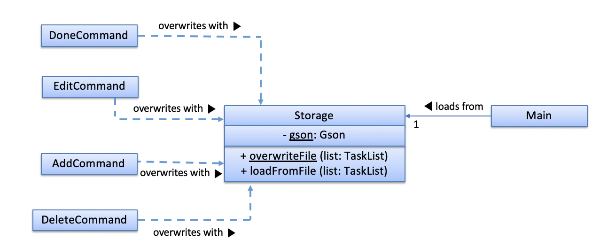

# Ricardo Sanchez-Macias - Project Portfolio 
## PROJECT: CALENDAR APPLICATION FOR STUDENTS

## Overview
**Calendar Application For Students (CAFS)** is a calendar application used to 
track the daily events in a student's life. The user interacts with the
application using a CLI. It is written in Java. 

### Summary of Contributions
* Code Contributed: [Functional Code](https://nus-cs2113-ay1920s2.github.io/tp-dashboard/#=undefined&search=rsanchez-macias)
* Contributions:  
  * TaskList(initial version): manages the tasks in the list  
  * JUnit Tests: added tests for Parser and Storage class
  * UI: refactored messages to Message class and formatted feedback shown to the user
     * Categorize type of errors as `error` and `alert`
  * Storage: able to instantiate Json strings to Class and NonClassTask instances
  * Find Command(initial version): searches pattern in task title and description only 
  * Clear Command: clears output in terminal window  
  * Help Command: formatted output to follow UG
  * Documentation: fix links to UG, DG, and About Us

### Contribution to User Guide:

* Structure enhancement.
* Fix typos and formatting issues.
* Below is a section contributed to User Guide: 
---
### 3.7. Finding tasks: `find`
Searches all task titles, descriptions, and locations for supplied pattern  
**Usage**: `find <PATTERN>`
* Keyword is case _insensitive_
* Can search the pattern in title, description and location. 

Examples:
* `find project meeting`  
Lists the tasks with the given pattern (`project meeting`) if found in their title, description, or location
---

### Contribution to the Developer Guide:
* Below is a section contributed to Developer Guide:

---
### 2.4. Storage Component 

The Storage component consists of a single class that parses `Task` instances to Json strings using an external library, Gson by Google.  
This component,
* can load from a text file Json strings and parse them to `Task` instances 
* can parse `Task` instances to Json strings and save them in a text file

Below is a class diagram showing the interactions of this component with other classes.

---

### 3.4. Storage
#### 3.4.1 Proposed Implementation
The Storage mechanism is facilitated through the Gson library implemented by Google. Tasks
are loaded from the `Main` class and saved from the  `done`, `edit`, `add`, and `delete` commands.

The interaction is similar for all the commands. Below is a sequence diagram showing the interactions between classes when a task is added to the list:

1. The user inputs the `add` command. After being parsed, the command is executed.
1. The `add` command adds a `Task` instance to the `taskList`.
1. After successful addition of the task, the `add` command calls the Storage#overwriteFile() to 
overwrite all the current tasks from the `taskList` to the external `data.txt` file.

#### 3.4.2 Design Considerations
1. Aspect: Saving tasks
* Alternative 1:(current choice) Overwrite all tasks in the `taskList` to the `data.txt` file when a task is edited, added, done, or deleted.  
  * Pros: Less code and easier to maintain and implement
  * Cons: Redoing work that has been done before, thus wasting resources
* Alternative 2: Save only the specific tasks that is being edited, added, done, or deleted.
  * Pros: Saves resources since it only changes one task
  * Cons: Difficult and tedious to implement since Json strings are being kept in a text file. For example, it would be hard
  to know which specific class was edited or deleted from the text file.
  
3. Aspect: How to save tasks
* Alternative 1:(current choice) Save tasks individually as Json strings in the text file. Json strings
are separated by new lines in the file. When loading tasks, check whether they are instances of 
`TaskNonClass` or `Class`.
  * Pros: Avoid overflow of a single Java String since we can have many tasks in the list at a given time
  * Cons: Tedious to keep track of in the external text file
* Alternative 2: Save the whole `taskList` as a Json string in the external text file.
  * Pros: Easy to implement both overwriting and loadings tasks from the text file.
  * Cons: May overflow a Java String faster if there are many tasks in the list at a given time.
  

